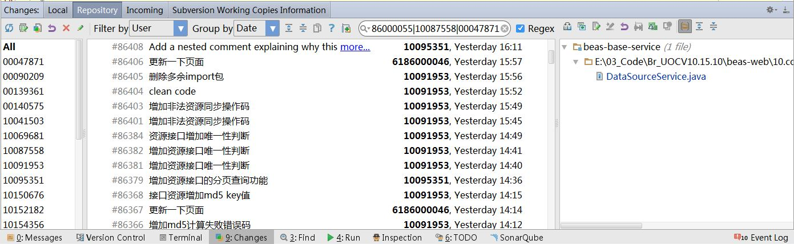
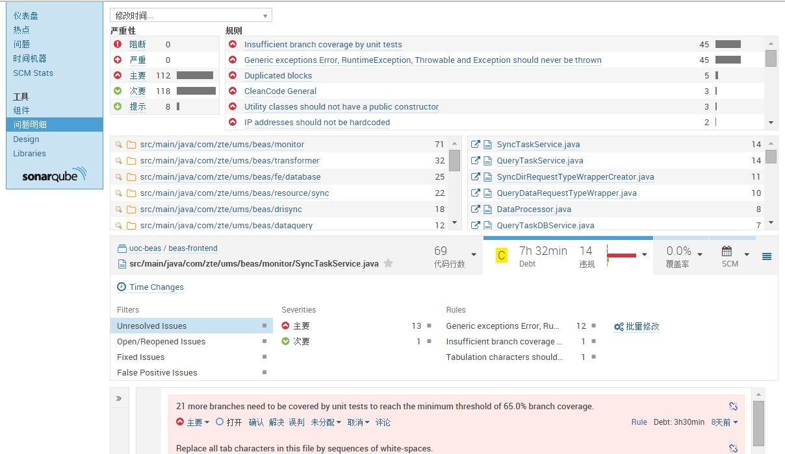

## 为什么要代码走查
敏捷内建质量的要求，代码是债务，代码走查可以减少技术债([technical debt](http://martinfowler.com/bliki/TechnicalDebt.html))，保持cost of changes

## 代码走查常见痛点
* 时间长
 + 需要走查代码多
 + 讨论业务细节
 + 缺乏权威意见，容易争论，无法达成一致
* 成本高
 + 团队全体成员参加，成本高
* 效果不明显
 + 代码走查想做的事太多：知识传递、提升技能、业务交流、消除模块壁垒，结果很可能什么目的都没有达到

## 怎样才能高效代码走查

### 高效走查的前提

要做到高效代码走查需要具备两个前提条件：

* 精益需求管理（少做多得）
* 结对编程

代码走查是有成本的。如果每天花费精力走查一些原本可以更简洁的代码，或者走查一些最后被证明并不是用户想要的代码，会造成极大的浪费。因此，需要精益需求管理来保证代码走查用在对的地方，需要结对编程来保证每天走查的代码尽可能的少，并有一定的质量（由于结对编程，产生的代码量会减少、同时质量也会提高）。

每个人都应该思考一下：这个特性能否不写代码实现？如果需要写代码，能否少写代码，使用第三方库，复用已有的代码？最后，如果无法避免要写代码，能否尽力写出最好的代码？

至于“好”的标准，需在代码走查中达成共识。

### 走查时机的选择

代码走查的时机一般有两种：

* 功能/故事完成后代码走查：当一个功能/故事完成后，对这些代码进行走查。
* 每日代码走查：每天都对前一天产生的新增代码进行走查。

第一种方式主要有两个缺点：

* 走查代码的范围比较难确定：敏捷开发中，功能/故事一般会持续3-5天，等到完成后哪些代码属于这个功能/故事已经不易确定。
* 走查出的问题，易被抵触：一旦功能/故事开发完成，再对代码提出修改意见，可能会受到较大抵触。

相比第一种走查方式，每日代码走查能够更好的圈定走查代码的范围，并且在功能/故事开发中提出建议，团队成员也更乐于接受。

高效代码走查需要高效工具的支撑。能够比较每日增量代码diff工具很多，IDE是其中之一。IDE的优势很明显，它除了获取增量代码还可以极方便对代码进行导航浏览，相对于svn自带的diff工具，IDE在这方面效率非常高。

IntelliJ的Changes功能

### 确定走查关注点

代码走查时应该关注哪些方面的事情？是关注业务逻辑实现的正确性，还是其他？

每日代码走查时间一般不会很长。在不长的时间里，我们尽可能聚焦在某个特定的关注上，而不是什么都想做。

一般来说，团队初期的代码走查聚焦在代码整洁及消除[无意识或不经思考而引入的技术债](http://martinfowler.com/bliki/TechnicalDebtQuadrant.html)上。

对于刚开始尝试代码走查的团队，不建议将关注点放在业务逻辑上。原因主要有：

* 业务逻辑的正确性更多的是通过测试用例来保证，并且这种努力需要分散在我们开发的各个环节。
* 团队初期代码走查过度关注业务逻辑，也容易导致话题发散、时间过长、走查低效。

SonarQube能很好的帮助我们聚焦关注点。它会根据严重程度列出项目的所有“问题”，而这些问题大多是关于代码整洁以及技术债务方面的。团队只需要按照优先级选择“问题”进行指派解决即可。

### 确定走查流程：
代码走查的时机确定了，关注点确定了，走查的范围就确定了。

下面看下高效代码走查的流程：

1. 走查增量代码，创建“手工问题”
2. 走查“问题”，确定解决方案，指派实施

步骤1可以选择实施，实施时也一般有两种做法：

* 可以在代码走查前由TL/教练单独进行走查，提交“手工问题”
* 也可以在走查时由TL/教练带领进行

“手工问题”仍需要注意关注点的聚焦，这方面尽量与Sonar的“问题”关注点保持一致，否则在代码走查时仍容易引起讨论发散。

SonarQube官网上给的[使用Sonar进行高效走查](http://www.sonarqube.org/effective-code-review-with-sonar/)的文章

[创建“手工问题”]()的方法

### 常见的走查效率提升工具
intellij diff:

intellij sonarqube plugin

manual code review:
http://www.sonarqube.org/sonar-2-8-in-screenshots/

action plan:

auto-assign:

scm stats: